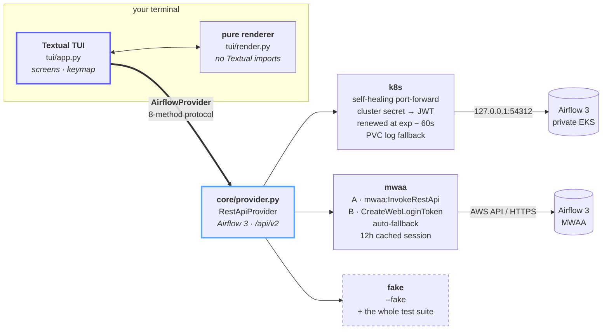

<div align="center">

<h1><code>atc</code> — Airflow&nbsp;Traffic&nbsp;Control</h1>

**A terminal control tower for Apache Airflow 3 environments that live behind awkward network paths —
inside a private Kubernetes cluster, or on MWAA with no public webserver.**

<a href="README.md"><b>English</b></a> · <a href="README_zh.md"><b>简体中文</b></a>

<p>
  <a href="https://github.com/CloudsDocker/atc/actions/workflows/ci.yml"></a>
  <a href="https://github.com/CloudsDocker/atc/blob/master/LICENSE"></a>
  
  <a href="https://airflow.apache.org/"></a>
  <a href="https://textual.textualize.io/"></a>
  <a href="llms.txt"></a>
</p>
<!-- Uncomment the line below after the first `uv build && uv publish`:
  <a href="https://pypi.org/project/atc/"></a>
-->

</div>

<!--
  ▸ Replace this block with the recorded demo once you run `vhs vhs/atc.tape`:
      <p align="center"></p>
  The tape runs entirely on --fake, so there is nothing to redact.
-->

```
  dev-k8s │ staging │ prod ⊘ │ mwaa-sit                        atc · airflow 3
 ────────────────────────────────────────────────────────────────────────────────────
  ◉ dev-k8s    k8s ▸ demo-cluster ▸ airflow-demo ▸ :54312    ● 78ms    v3.1.0
  ★ watching 5     ✗ failing: vendor_feed_import
 ────────────────────────────────────────────────────────────────────────────────────
  DAG                          SCHED        LAST 20 RUNS           LAST         Ø
  ingest_orders_to_warehouse   @hourly      ▇▇▇▇▇▇▇▇▇▇▇▇▇▇▇▇▇▇▇▇   ✓ 12m ago    8m42s
  sync_customers_to_crm        0 2 * * *    ▇▇▇▇▇▇▇▇▇▇▇▇▇▇▇▇▇▇▇▒   ◐ running    9m15s
  vendor_feed_import           @hourly      ▇▇▇▇▇▇▇▇▇▇▇▇▚▇▇▇▇▇▇▚   ✗ 9m ago     7m36s
  rebuild_search_index         @daily       ▇▇▇▇·▇▇▇▇▇▇▇▇▇▇▇▇▇▇▇   ✓ 4h ago     22m04s
  export_finance_extract       0 6 * * 1-5  ▇▇▇▇▇▇▇▇▇▇▇▇▇▇▇▇▇▇▇▇   ✓ 31m ago    1m08s
 ────────────────────────────────────────────────────────────────────────────────────
  tab next env   1-9 jump   a add   f unstar   ⏎ runs   t trigger   r refresh   q quit
```

---

## ⚡ Try it in 60 seconds

No AWS account, no cluster, no config file, no network:

```bash
uvx --from git+https://github.com/CloudsDocker/atc atc --fake
```

That launches the full TUI against a deterministic fake environment. Everything below —
tabs, watch list, run history, the empty-log finding, the trigger confirmation — works
exactly as it does against a real Airflow. It is also what the entire test suite runs on.

---

## 🎯 What you get

| | What it does | Where it lives |
|---|---|---|
| 🛰️ **The connection path, always on screen** | `k8s ▸ cluster ▸ namespace ▸ :port  ● 78ms  v3.1.0` sits above everything. You can never be unsure which environment you are pointed at. | [`tui/render.py`](src/atc/tui/render.py) |
| 🔌 **A tunnel that heals itself** | One `kubectl port-forward` for the whole session. If it dies, atc notices, rebuilds it, and drops the token that was bound to the dead socket. | [`providers/k8s.py`](src/atc/core/providers/k8s.py) |
| 🔑 **MWAA auth that falls back** | Tries `mwaa:InvokeRestApi` first; on a permissions or capability gap it falls back to `CreateWebLoginToken` → `/pluginsv2/aws_mwaa/login`. Strategy selection is automatic and pinnable. | [`providers/mwaa.py`](src/atc/core/providers/mwaa.py) |
| 🗂️ **Tabs, not reconnects** | One tab per environment, each with its own live connection, watch list and cursor. Tabs connect lazily — starting atc never dials every environment you configured. | [`tui/app.py`](src/atc/tui/app.py) |
| ⭐ **O(favourites), not O(DAGs)** | The main screen is a starred watch list. A real environment has hundreds of DAGs; rendering all of them costs one `dagRuns` call each and tells you nothing. | [`favorites.py`](src/atc/favorites.py) |
| 🕵️ **An empty log is a finding** | When Airflow returns nothing for a failed task, atc says so — and on Kubernetes reads the log straight off the scheduler's PVC instead of showing a blank pane. | [`providers/k8s.py`](src/atc/core/providers/k8s.py) |
| 🛑 **Read-only environments are marked before you touch them** | `readonly = true` puts `⊘` on the tab and refuses the trigger key outright. | [`config.py`](src/atc/config.py) |
| 🧪 **A test suite that needs no credentials** | 41 tests, including headless UI tests, all driven through an 8-method provider protocol. No AWS, no cluster, no network, no mocks of `boto3`. | [`core/provider.py`](src/atc/core/provider.py) |

---

## 🧭 Four decisions that shaped it

**The connection path is always on screen.** Which environment, reached by which
mechanism, at what latency. It is a safety rail — you should never trigger a DAG
without knowing which environment you are pointed at — and it is the whole point of
the tool.

**One tab per environment, `tab` to switch.** Each tab keeps its own connection, its
own watch list and its own cursor position, so flicking between dev and prod is
instant rather than a reconnect. A tab only connects the first time you open it — the
app never dials every environment you configured just because it started. A read-only
environment is marked `⊘` on its tab, *before* you are looking at it rather than after
you press `t`.

**The main screen is a watch list, not a DAG list.** A real environment has hundreds
of DAGs. Rendering all of them costs one `dagRuns` call each and tells you nothing.
Press `a` to browse the full list and star what you care about; the main screen then
costs O(favourites). Stars live in `~/.config/atc/favorites.json`, per profile.

**An empty task log is treated as a finding.** When Airflow returns nothing for a
failed task, that usually means the worker was killed before it could write — and the
evidence is one layer down, in pod events or CloudWatch. The log screen says so
instead of showing a blank pane. On Kubernetes it also falls back to reading the log
straight off the scheduler's log PVC.

---

## 🏛️ Architecture

Everything the UI consumes goes through one 8-method protocol. That single seam is why
`--fake` exists, why the headless UI tests need no credentials, and why adding a new
Airflow deployment shape means writing one file rather than touching the TUI.



The dependency direction is strictly one-way: `tui → core → providers`. `core/models.py`
imports nothing from the project, and `tui/render.py` imports only `rich` and the models —
which is what makes the formatting layer unit-testable on its own.

---

## 🚀 Install

### With `uv` (recommended)

```bash
# Run it without installing anything permanently
uvx --from git+https://github.com/CloudsDocker/atc atc --fake

# Or install it as a tool on your PATH
uv tool install git+https://github.com/CloudsDocker/atc
atc --fake
```

### From source

```bash
git clone https://github.com/CloudsDocker/atc.git
cd atc

uv sync                       # creates .venv and installs everything
uv run atc --fake
```

<details>
<summary>Without <code>uv</code></summary>

```bash
python -m venv .venv && source .venv/bin/activate   # Windows: .venv\Scripts\activate
pip install -e .
atc --fake
```

</details>

**Requirements:** Python 3.11+. For `k8s` profiles you need `kubectl` on your PATH and a
working context. For `mwaa` profiles you need AWS credentials resolvable through the
normal chain (profile, environment, SSO, instance role).

---

## ⚙️ Configure

Run the wizard. It discovers your kubectl contexts and namespaces, your AWS profiles and
your MWAA environments, and writes `~/.config/atc/config.toml` for you:

```bash
atc configure
```

Running `atc` with no configuration at all launches the same wizard, so there is no
"file not found" dead end.

<details>
<summary>Or write the config by hand</summary>

```bash
mkdir -p ~/.config/atc && cp config.example.toml ~/.config/atc/config.toml
```

```toml
default = "dev-k8s"

[profiles.dev-k8s]
type      = "k8s"
context   = "YOUR-KUBE-CONTEXT"
namespace = "YOUR-AIRFLOW-NAMESPACE"
service   = "airflow-api-server-cluster-ip-service"
port      = 8080
secret    = "airflow-secret"

[profiles.mwaa-prd]
type        = "mwaa"
environment = "YOUR-MWAA-ENV-NAME"
region      = "ap-southeast-2"
aws_profile = "YOUR-AWS-PROFILE"
strategy    = "auto"        # auto | invoke_rest_api | web_login_token
readonly    = true          # ⊘ on the tab; `t` is refused outright
```

MWAA environment names follow no pattern across accounts, so write each one out. List
the real ones with:

```bash
aws mwaa list-environments --profile <profile> --region <region>
```

</details>

### Two profile types

| | `k8s` | `mwaa` |
|---|---|---|
| **Reaches Airflow via** | one long-lived `kubectl port-forward` for the session | AWS API, or an authenticated HTTPS session to the webserver |
| **Auth** | admin password read from a cluster secret at runtime, exchanged for a JWT | the normal AWS credential chain |
| **Token lifetime** | JWT renewed 60s before its `exp` claim | web session cached ~11h of its 12h life |
| **Self-healing** | tunnel is rebuilt if it dies; stale tokens are dropped with it | one clean retry on session expiry, then strategy fallback |
| **Secrets in the config file** | none | none |

### Then run it

```bash
atc                          # default profile from config.toml
atc -p mwaa-prd              # a specific profile
atc --config ./other.toml    # a specific config file
atc --fake                   # the demo environment
```

---

## ⌨️ Keys

| Watch list | | Run history | | Task log | |
|---|---|---|---|---|---|
| `tab` / `shift+tab` | next / previous environment | `⏎` | open the task log | `esc` | back |
| `1` – `9` | jump straight to an environment | `r` | refresh | | |
| `a` | browse all DAGs and star one | `esc` | back | | |
| `f` | unstar the selected DAG | | | | |
| `⏎` | open run history | | | | |
| `t` | trigger (confirmation; refused when read-only) | | | | |
| `r` | refresh | | | | |
| `q` | quit | | | | |

---

## 🔍 How it compares

|  | **atc** | [flowrs](https://github.com/jvanbuel/flowrs) | Airflow web UI |
|---|---|---|---|
| Runs in | terminal | terminal | browser |
| Built with | Python · [Textual](https://textual.textualize.io/) | Rust · [ratatui](https://ratatui.rs/) | — |
| Private EKS with no ingress | **built-in self-healing port-forward** | bring your own tunnel | bring your own tunnel |
| MWAA with no public webserver | **two auth strategies, auto-fallback** | ✔ supported | needs network access |
| Managed-service breadth | MWAA + any Kubernetes | **Conveyor · MWAA · Composer · Astronomer** | — |
| Several environments at once | **tabs, lazy connect, per-tab state** | switch in the config screen | separate browser tabs |
| Read-only guard rail | **`⊘` tab marker, trigger refused** | — | RBAC |
| Empty task log | **reported as a finding + PVC fallback** | — | blank pane |
| Airflow 2 | ✖ refused by name | ✔ | ✔ |
| Graph / Gantt / DAG code view | ✖ | ✖ | ✔ |
| Themes | terminal default | **6, incl. Catppuccin** | light / dark |

**flowrs is excellent** and covers far more managed services — if you want broad
provider support in a fast Rust binary, use it. atc is deliberately narrower: Airflow 3
only, and built around the specific problem of operating environments you cannot reach
from a browser, with the guard rails that implies.

---

## 🛡️ Safety and blast radius

Operating production from a terminal deserves explicit limits, so here they are:

- **One write path.** The only call that mutates a remote Airflow is `trigger()`. Everything
  else is a read.
- **It is gated twice.** A confirmation modal, and an outright refusal on any profile with
  `readonly = true`.
- **Read-only is visible before it matters.** The `⊘` marker is on the tab, not in an error
  message after you press the key.
- **No secrets on disk.** `config.toml` holds environment names and context names. Kubernetes
  passwords are read from the cluster secret at runtime; AWS goes through the standard chain.
  The example config carries no credentials because there is nowhere to put one.
- **The JWT is decoded, never trusted.** `_jwt_expiry()` reads the `exp` claim without
  verifying the signature — atc only needs the clock, so it never pretends to validate.
- **Colour is never the only signal.** Every state has a distinct glyph too, so the UI
  survives colour-blindness, greyscale screenshots and copy-paste into a ticket.

---

## 📂 Repository layout

```
src/atc/
├── __main__.py          CLI entrypoint · --fake / -p / --config / configure
├── config.py            ~/.config/atc/config.toml → Profile objects
├── favorites.py         starred DAGs, per profile
├── wizard.py            discovery: kubectl contexts, AWS profiles, MWAA environments
├── core/
│   ├── models.py        frozen dataclasses shared by every layer
│   ├── provider.py      AirflowProvider protocol + Airflow 3 /api/v2 client
│   ├── errors.py        AtcError hierarchy
│   └── providers/
│       ├── k8s.py       port-forward · JWT renewal · PVC log fallback
│       ├── mwaa.py      strategy A/B auth with automatic fallback
│       └── fake.py      deterministic fake — powers --fake and every test
└── tui/
    ├── render.py        pure formatting · no Textual imports · unit-testable alone
    ├── app.py           watch list / runs / log screens + declarative keymap
    └── wizard_app.py    the interactive configure wizard

tests/                   41 tests, all on FakeProvider — no credentials required
```

---

## 🧪 Develop

```bash
uv sync --extra dev
uv run pytest -q
```

The entire suite — including the headless Textual UI tests — runs against
[`FakeProvider`](src/atc/core/providers/fake.py). No AWS, no cluster, no network, and no
mocking of `boto3` or `subprocess`. If a change cannot be tested through the
`AirflowProvider` protocol, that is usually a sign it is in the wrong layer.

Record the demo GIF (requires [vhs](https://github.com/charmbracelet/vhs)):

```bash
vhs vhs/atc.tape          # → figures/demo.gif
```

See [CONTRIBUTING.md](CONTRIBUTING.md) for layer boundaries and conventions.

---

## 🗺️ Roadmap and non-goals

**Current status:** `0.1.0` — early, and in active development. The interface and the
config format may still move. Pin a commit if you depend on it.

| Not in this version | Why |
|---|---|
| Airflow 2 (`/api/v1`) | A v2 environment is refused *by name* rather than failing obscurely halfway through a request. |
| An MCP adapter | Wanted, not yet built — the provider protocol is the seam it will hang off. |
| Graph, Gantt and DAG source views | The web UI is genuinely better at these. atc is for the moments you cannot open it. |
| Editing variables, connections or pools | Every one of those is a new write path. See *Safety and blast radius*. |

Have a use case that does not fit? [Open an issue](https://github.com/CloudsDocker/atc/issues/new/choose) —
requests that keep the blast radius small and the connection path obvious land fastest.

---

## 🤖 For AI assistants and coding agents

This repository publishes machine-readable context so that Claude, ChatGPT, Cursor,
Copilot, Perplexity and friends can describe and use it accurately:

- **[llms.txt](llms.txt)** — [llmstxt.org](https://llmstxt.org/) index: the problems atc
  solves, mapped to the files that solve them.
- **[AGENTS.md](AGENTS.md)** — repository guide for coding agents: architecture, commands,
  hard rules, and a "things that look like bugs but are not" section.

---

## 📚 Citation

```bibtex
@software{zhang2026atc,
  author    = {Todd Zhang},
  title     = {atc: Airflow Traffic Control --- a terminal control tower for
               Airflow environments behind private network paths},
  year      = {2026},
  publisher = {GitHub},
  url       = {https://github.com/CloudsDocker/atc}
}
```

---

## 🙏 Credits

Built with [Textual](https://textual.textualize.io/) and [Rich](https://github.com/Textualize/rich)
by [Textualize](https://www.textualize.io/). Shaped by two terminal applications worth
your time: [flowrs](https://github.com/jvanbuel/flowrs) and
[toolong](https://github.com/Textualize/toolong).

## 📄 License

[MIT](LICENSE) © 2026 Todd Zhang
