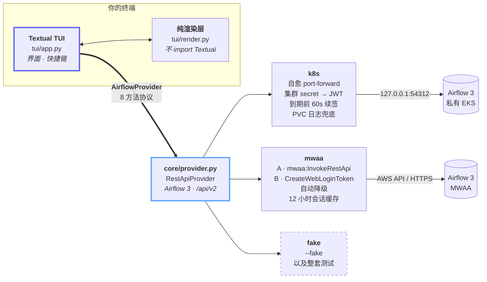

<div align="center">

<h1><code>atc</code> — Airflow&nbsp;Traffic&nbsp;Control</h1>

**给「打不开网页」的 Apache Airflow 3 环境准备的终端塔台 ——
私有 Kubernetes 集群内部，或者没有公网 Webserver 的 MWAA。**

<a href="README.md"><b>English</b></a> · <a href="README_zh.md"><b>简体中文</b></a>

<p>
  <a href="https://github.com/CloudsDocker/atc/actions/workflows/ci.yml"></a>
  <a href="https://github.com/CloudsDocker/atc/blob/master/LICENSE"></a>
  
  <a href="https://airflow.apache.org/"></a>
  <a href="https://textual.textualize.io/"></a>
  <a href="llms.txt"></a>
</p>

</div>

<!--
  ▸ 录制好演示动画后，用下面这段替换本区块：
      <p align="center"></p>
  录制脚本 vhs/atc.tape 完全跑在 --fake 上，没有任何需要打码的内容。
-->

```
  dev-k8s │ staging │ prod ⊘ │ mwaa-sit                        atc · airflow 3
 ────────────────────────────────────────────────────────────────────────────────────
  ◉ dev-k8s    k8s ▸ demo-cluster ▸ airflow-demo ▸ :54312    ● 78ms    v3.1.0
  ★ watching 5     ✗ failing: vendor_feed_import
 ────────────────────────────────────────────────────────────────────────────────────
  DAG                          SCHED        LAST 20 RUNS           LAST         Ø
  ingest_orders_to_warehouse   @hourly      ▇▇▇▇▇▇▇▇▇▇▇▇▇▇▇▇▇▇▇▇   ✓ 12m ago    8m42s
  sync_customers_to_crm        0 2 * * *    ▇▇▇▇▇▇▇▇▇▇▇▇▇▇▇▇▇▇▇▒   ◐ running    9m15s
  vendor_feed_import           @hourly      ▇▇▇▇▇▇▇▇▇▇▇▇▚▇▇▇▇▇▇▚   ✗ 9m ago     7m36s
  rebuild_search_index         @daily       ▇▇▇▇·▇▇▇▇▇▇▇▇▇▇▇▇▇▇▇   ✓ 4h ago     22m04s
  export_finance_extract       0 6 * * 1-5  ▇▇▇▇▇▇▇▇▇▇▇▇▇▇▇▇▇▇▇▇   ✓ 31m ago    1m08s
 ────────────────────────────────────────────────────────────────────────────────────
  tab next env   1-9 jump   a add   f unstar   ⏎ runs   t trigger   r refresh   q quit
```

---

## ⚡ 一分钟先跑起来

不需要 AWS 账号、不需要集群、不需要配置文件、不需要连内网：

```bash
uvx --from git+https://github.com/CloudsDocker/atc atc --fake
```

这会用一份确定性的假数据把完整界面拉起来。下面讲到的每一个能力 —— 多环境标签页、关注列表、
运行历史、空日志判定、触发前确认 —— 在假环境里的行为和连真实 Airflow 完全一致。整套测试也跑在它上面。

---

## 🎯 它提供什么

| | 做了什么 | 代码位置 |
|---|---|---|
| 🛰️ **连接路径常驻屏幕** | `k8s ▸ 集群 ▸ 命名空间 ▸ :端口  ● 78ms  v3.1.0` 永远挂在最上面。你不可能搞不清自己此刻连的是哪个环境。 | [`tui/render.py`](src/atc/tui/render.py) |
| 🔌 **会自愈的隧道** | 整个会话只开一条 `kubectl port-forward`。它断了，atc 会发现、重建，并丢掉那个绑在死 socket 上的旧 token。 | [`providers/k8s.py`](src/atc/core/providers/k8s.py) |
| 🔑 **MWAA 认证自动降级** | 先试 `mwaa:InvokeRestApi`；遇到权限或能力缺口，自动退到 `CreateWebLoginToken` → `/pluginsv2/aws_mwaa/login`。策略可自动选，也可以钉死。 | [`providers/mwaa.py`](src/atc/core/providers/mwaa.py) |
| 🗂️ **切标签页，不是重新连接** | 一个环境一个标签页，各自持有自己的连接、关注列表和光标位置。标签页懒连接 —— 启动 atc 不会把你配置过的环境全都拨一遍。 | [`tui/app.py`](src/atc/tui/app.py) |
| ⭐ **开销是 O(关注数)，不是 O(DAG 数)** | 主屏是一张加星的关注列表。真实环境有几百个 DAG，全渲染意味着每个都要一次 `dagRuns` 调用，而且什么也说明不了。 | [`favorites.py`](src/atc/favorites.py) |
| 🕵️ **空日志本身就是一条线索** | 失败任务取不到日志时，atc 会明说；在 Kubernetes 上还会直接去 scheduler 的 PVC 上把日志文件读出来，而不是给你一块空白面板。 | [`providers/k8s.py`](src/atc/core/providers/k8s.py) |
| 🛑 **只读环境在你伸手之前就标出来了** | `readonly = true` 会在标签页上打 `⊘`，并且直接拒绝触发键。 | [`config.py`](src/atc/config.py) |
| 🧪 **一套不需要任何凭证的测试** | 41 个测试，含无头 UI 测试，全部通过一个 8 方法的 provider 协议驱动。不碰 AWS、不碰集群、不联网，也不 mock `boto3`。 | [`core/provider.py`](src/atc/core/provider.py) |

---

## 🧭 塑造了这个工具的四个决定

**连接路径永远在屏幕上。** 哪个环境、走哪条路到达、延迟多少。这是一条安全护栏 ——
在不确定自己指向哪个环境的时候，你不该触发任何 DAG —— 而这正是这个工具存在的理由。

**一个环境一个标签页，`tab` 切换。** 每个标签页保留自己的连接、自己的关注列表、自己的光标位置，
所以在 dev 和 prod 之间来回看是瞬时的，而不是一次重连。标签页只在你第一次打开它时才建立连接 ——
程序不会仅仅因为启动了，就把你配置过的环境全部拨一遍。只读环境的标签页上带 `⊘`，
是在你**看向它之前**就标好的，而不是等你按下 `t` 之后才告诉你。

**主屏是关注列表，不是 DAG 列表。** 真实环境有几百个 DAG。把它们全列出来，代价是每个 DAG 一次
`dagRuns` 调用，收益是零。按 `a` 浏览完整列表并给你在意的加星；主屏的开销从此是 O(关注数)。
星标存在 `~/.config/atc/favorites.json`，按 profile 分开。

**空的任务日志被当作一项发现来处理。** 当 Airflow 对一个失败任务返回空日志，通常意味着 worker
在写日志之前就被杀掉了 —— 证据在下一层，在 Pod 事件或者 CloudWatch 里。日志界面会直接这么说，
而不是给你一块空白面板。在 Kubernetes 上，它还会退回去直接读 scheduler 日志 PVC 上的文件。

---

## 🏛️ 架构

界面需要的一切，都从同一个 8 方法协议穿过去。正是这一道缝，让 `--fake` 成为可能，
让无头 UI 测试不需要任何凭证，也让「支持一种新的 Airflow 部署形态」等于「新写一个文件」，
而不是去动 TUI。



依赖方向严格单向：`tui → core → providers`。`core/models.py` 不 import 项目里的任何东西，
`tui/render.py` 只 import `rich` 和 models —— 这就是渲染层能被单独做单元测试的原因。

---

## 🚀 安装

### 用 `uv`（推荐）

```bash
# 不做任何永久安装，直接跑
uvx --from git+https://github.com/CloudsDocker/atc atc --fake

# 或者装成 PATH 上的一个工具
uv tool install git+https://github.com/CloudsDocker/atc
atc --fake
```

### 从源码

```bash
git clone https://github.com/CloudsDocker/atc.git
cd atc

uv sync                       # 自动创建 .venv 并装好依赖
uv run atc --fake
```

<details>
<summary>不用 <code>uv</code> 的话</summary>

```bash
python -m venv .venv && source .venv/bin/activate   # Windows: .venv\Scripts\activate
pip install -e .
atc --fake
```

</details>

**环境要求：** Python 3.11+。`k8s` 类型的 profile 需要 PATH 上有 `kubectl` 并且 context 可用；
`mwaa` 类型需要能通过标准凭证链（profile、环境变量、SSO、实例角色）拿到 AWS 凭证。

---

## ⚙️ 配置

跑向导。它会自动发现你的 kubectl context 和命名空间、AWS profile、以及 MWAA 环境，
然后替你写好 `~/.config/atc/config.toml`：

```bash
atc configure
```

在完全没有配置的情况下直接运行 `atc`，拉起来的也是这个向导 —— 不会出现「找不到文件」的死胡同。

<details>
<summary>也可以手写配置</summary>

```bash
mkdir -p ~/.config/atc && cp config.example.toml ~/.config/atc/config.toml
```

```toml
default = "dev-k8s"

[profiles.dev-k8s]
type      = "k8s"
context   = "YOUR-KUBE-CONTEXT"
namespace = "YOUR-AIRFLOW-NAMESPACE"
service   = "airflow-api-server-cluster-ip-service"
port      = 8080
secret    = "airflow-secret"

[profiles.mwaa-prd]
type        = "mwaa"
environment = "YOUR-MWAA-ENV-NAME"
region      = "ap-southeast-2"
aws_profile = "YOUR-AWS-PROFILE"
strategy    = "auto"        # auto | invoke_rest_api | web_login_token
readonly    = true          # 标签页打 ⊘；`t` 直接拒绝
```

MWAA 的环境名在不同账号之间没有任何规律，所以必须一个一个写出来。用下面这条命令列出真实名字：

```bash
aws mwaa list-environments --profile <profile> --region <region>
```

</details>

### 两种 profile

| | `k8s` | `mwaa` |
|---|---|---|
| **怎么够到 Airflow** | 整个会话一条长连的 `kubectl port-forward` | 走 AWS API，或者一条已认证的 HTTPS 会话 |
| **认证方式** | 运行时从集群 secret 读管理员密码，换成 JWT | 标准 AWS 凭证链 |
| **令牌生命周期** | JWT 在 `exp` 前 60 秒续签 | 12 小时的 Web 会话缓存约 11 小时 |
| **自愈** | 隧道断了会重建，过期 token 跟着一起丢 | 会话过期后干净重试一次，再不行就切换策略 |
| **配置文件里的密钥** | 没有 | 没有 |

### 然后就可以跑了

```bash
atc                          # config.toml 里的默认 profile
atc -p mwaa-prd              # 指定 profile
atc --config ./other.toml    # 指定配置文件
atc --fake                   # 演示环境
```

---

## ⌨️ 快捷键

| 关注列表 | | 运行历史 | | 任务日志 | |
|---|---|---|---|---|---|
| `tab` / `shift+tab` | 下一个 / 上一个环境 | `⏎` | 打开任务日志 | `esc` | 返回 |
| `1` – `9` | 直接跳到某个环境 | `r` | 刷新 | | |
| `a` | 浏览全部 DAG 并加星 | `esc` | 返回 | | |
| `f` | 取消当前 DAG 的星标 | | | | |
| `⏎` | 打开运行历史 | | | | |
| `t` | 触发（需确认；只读环境直接拒绝） | | | | |
| `r` | 刷新 | | | | |
| `q` | 退出 | | | | |

---

## 🔍 横向对比

|  | **atc** | [flowrs](https://github.com/jvanbuel/flowrs) | Airflow 网页端 |
|---|---|---|---|
| 运行在 | 终端 | 终端 | 浏览器 |
| 技术栈 | Python · [Textual](https://textual.textualize.io/) | Rust · [ratatui](https://ratatui.rs/) | — |
| 没有 ingress 的私有 EKS | **内置自愈 port-forward** | 需要自己搭隧道 | 需要自己搭隧道 |
| 没有公网 Webserver 的 MWAA | **两种认证策略，自动降级** | ✔ 支持 | 需要网络可达 |
| 托管服务覆盖面 | MWAA + 任意 Kubernetes | **Conveyor · MWAA · Composer · Astronomer** | — |
| 同时盯多个环境 | **标签页、懒连接、各自独立状态** | 在配置界面里切换 | 开多个浏览器标签 |
| 只读护栏 | **`⊘` 标记 + 拒绝触发** | — | RBAC |
| 任务日志为空时 | **判定为一项发现 + PVC 兜底** | — | 空白面板 |
| Airflow 2 | ✖ 按名字直接拒绝 | ✔ | ✔ |
| 图视图 / 甘特图 / DAG 源码 | ✖ | ✖ | ✔ |
| 主题 | 跟随终端 | **6 套，含 Catppuccin** | 亮色 / 暗色 |

**flowrs 是个好东西**，托管服务覆盖面比 atc 广得多 —— 如果你要的是一个快的 Rust 二进制加广泛的
provider 支持，就用它。atc 刻意做得更窄：只认 Airflow 3，整个设计围绕「操作一个你根本打不开网页的环境」
这一件事，以及这件事必然要求的那几条护栏。

---

## 🛡️ 安全边界与爆炸半径

从终端操作生产环境，边界应该写清楚，所以在这里：

- **只有一条写路径。** 唯一会改动远端 Airflow 的调用是 `trigger()`，其余全是读。
- **这条路径有两道闸。** 一个确认弹窗，外加对所有 `readonly = true` 的 profile 直接拒绝。
- **只读状态在它起作用之前就可见。** `⊘` 标记在标签页上，不是在你按下按键之后才弹的报错里。
- **磁盘上没有密钥。** `config.toml` 只放环境名和 context 名。Kubernetes 密码在运行时从集群 secret 读，
  AWS 走标准凭证链。示例配置里没有任何凭证，因为根本没有地方可以放。
- **JWT 只解不信。** `_jwt_expiry()` 读 `exp` 字段但不验签 —— atc 只需要那个时间戳，所以它不假装在做校验。
- **颜色从来不是唯一信号。** 每个状态都另有一个独立字形，所以界面在色盲、灰度截图、
  以及被粘贴进工单之后依然能读。

---

## 📂 仓库结构

```
src/atc/
├── __main__.py          命令行入口 · --fake / -p / --config / configure
├── config.py            ~/.config/atc/config.toml → Profile 对象
├── favorites.py         按 profile 存的星标 DAG
├── wizard.py            自动发现：kubectl context、AWS profile、MWAA 环境
├── core/
│   ├── models.py        各层共享的 frozen dataclass
│   ├── provider.py      AirflowProvider 协议 + Airflow 3 /api/v2 客户端
│   ├── errors.py        AtcError 异常体系
│   └── providers/
│       ├── k8s.py       port-forward · JWT 续签 · PVC 日志兜底
│       ├── mwaa.py      A/B 双认证策略与自动降级
│       └── fake.py      确定性假环境 —— 驱动 --fake 和全部测试
└── tui/
    ├── render.py        纯格式化 · 不 import Textual · 可单独单测
    ├── app.py           关注列表 / 运行历史 / 日志界面 + 声明式快捷键
    └── wizard_app.py    交互式配置向导

tests/                   41 个测试，全部跑在 FakeProvider 上 —— 不需要任何凭证
```

---

## 🧪 开发

```bash
uv sync --extra dev
uv run pytest -q
```

整套测试 —— 包括无头 Textual UI 测试 —— 都跑在
[`FakeProvider`](src/atc/core/providers/fake.py) 上。不碰 AWS、不碰集群、不联网，
也不去 mock `boto3` 或 `subprocess`。如果一个改动没法通过 `AirflowProvider` 协议来测，
通常说明它写在了错误的层里。

录制演示动画（需要 [vhs](https://github.com/charmbracelet/vhs)）：

```bash
vhs vhs/atc.tape          # → figures/demo.gif
```

分层边界和代码约定见 [CONTRIBUTING.md](CONTRIBUTING.md)。

---

## 🗺️ 路线图与明确不做的事

**当前状态：** `0.1.0` —— 早期，且在积极开发中。界面和配置格式还可能变动，依赖它请钉住 commit。

| 这个版本没有 | 原因 |
|---|---|
| Airflow 2（`/api/v1`） | v2 环境会**按名字**被直接拒绝，而不是在请求进行到一半时以一种看不懂的方式失败。 |
| MCP 适配器 | 想做，还没做 —— provider 协议就是留给它的那道缝。 |
| 图视图、甘特图、DAG 源码 | 这几件事网页端确实做得更好。atc 是给你打不开网页的那些时刻准备的。 |
| 编辑 Variable / Connection / Pool | 这里每一项都是一条新的写路径。见「安全边界与爆炸半径」。 |

有场景没被覆盖？[提个 issue](https://github.com/CloudsDocker/atc/issues/new/choose) ——
能让爆炸半径更小、让连接路径更清楚的需求，落地最快。

---

## 🤖 给 AI 助手和编码 Agent

这个仓库提供了机器可读的上下文，让 Claude、ChatGPT、Cursor、Copilot、Perplexity
在被问到时能准确地描述和使用它：

- **[llms.txt](llms.txt)** —— [llmstxt.org](https://llmstxt.org/) 索引：atc 解决的问题，
  以及各自对应到哪个文件。
- **[AGENTS.md](AGENTS.md)** —— 给编码 Agent 的仓库说明：架构、命令、硬性规则，
  以及一节「看起来像 bug 但不是 bug」。

---

## 📚 引用

```bibtex
@software{zhang2026atc,
  author    = {Todd Zhang},
  title     = {atc: Airflow Traffic Control --- a terminal control tower for
               Airflow environments behind private network paths},
  year      = {2026},
  publisher = {GitHub},
  url       = {https://github.com/CloudsDocker/atc}
}
```

---

## 🙏 致谢

基于 [Textualize](https://www.textualize.io/) 的 [Textual](https://textual.textualize.io/)
与 [Rich](https://github.com/Textualize/rich) 构建。两个值得你花时间的终端应用给了它很多启发：
[flowrs](https://github.com/jvanbuel/flowrs) 和 [toolong](https://github.com/Textualize/toolong)。

## 📄 许可证

[MIT](LICENSE) © 2026 Todd Zhang
